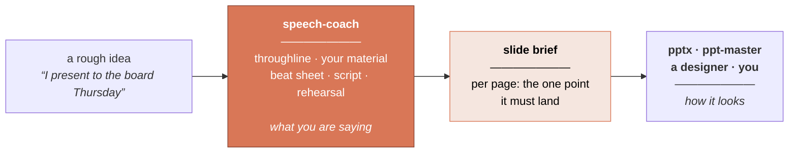

<div align="center">

# Speech Coach

**Work out what you're actually saying — before you make the slides.**

A Claude Agent Skill that turns a rough idea into a speech framework, a script written for
the ear, and a slide brief you hand to any PPT tool.

[](LICENSE)
[](https://code.claude.com/docs)
[](speech-coach/scripts/speech_check.py)

**English** · [简体中文](README.zh-CN.md)

</div>

---

> ### AI will build your deck in thirty seconds. It still can't tell you what to say.

There are dozens of tools now that turn a prompt into a polished presentation. They work.
Slides stopped being the hard part a while ago.

But nobody sat through a bad presentation and thought *the typography let this down*. They
thought: **I don't know what this person wanted from me.** That failure happens one step
earlier — before a single slide exists — and no amount of deck generation reaches back to
fix it.

This skill is that earlier step. It works out what you're saying, who has to move, and what
each page has to prove. Then it hands your deck tool a brief worth building.

---

## It doesn't replace your PPT tool. It feeds it.



The slide brief says *"page 3 must prove the manual work scales with revenue — two lines on
one axis, annotate where they cross."* It says nothing about fonts or palette, on purpose.
That's the deck builder's craft, and it's better left to them.

**Use this with whatever you already use to make slides.** They're solving different halves
of the same problem.

---

## What you get

| | |
|---|---|
| **A framework** | Your one sentence, the archetype that fits the occasion, and a beat sheet with time budgets and a visible tension curve |
| **A script** | Written for the ear, in *your* register, with pause marks and pre-planned cuts if you run long |
| **A slide brief** | Per page: the single point it must land, what has to be visible, what you say over it — ready to hand to any deck tool |
| **A rehearsal plan** | What to memorize, where to pause, the five hardest questions, what to do when the tech dies |

Plus a dependency-free checker that measures runtime against the clock, flags sentences
too long to say in one breath, and catches clichés.

---

## Install

```bash
git clone https://github.com/WinterDDo/Speech-Coach-Skill.git
cp -r Speech-Coach-Skill/speech-coach ~/.claude/skills/
```

For one project only, copy it into that repo's `.claude/skills/` instead.

Then just say what you're facing:

> *"I have ten minutes with the board on Thursday and I need two more engineers."*

> *"My sister's wedding is in three weeks and I'm the best man. I have nothing."*

> *"Here's my deck. It's 40 slides and it isn't landing. Why?"*

> *"I have to announce the layoffs on Monday."*

> *"How should I open a conference talk about database migrations?"*

It triggers on speeches, talks, keynotes, conference talks, pitches, investor decks,
product launches, all-hands and town halls, board updates, sales narratives, teaching
sessions, panels, toasts, wedding speeches, eulogies, award acceptances — and on
*"help me with my slides."*

---

## What makes it different from just asking for a speech

Ask any model to "write me a speech about X" and you get something fluent, structurally
generic, and full of details that never happened. Five things here work against that:

**It refuses to invent your life.** The most valuable thing in any speech is material only
you have — the night the line went down, the number that surprised you, what the customer
actually said. A model can supply structure, rhythm and craft. It cannot supply those, so
this asks instead of inventing. Missing material becomes `[YOUR STORY HERE — needs: …]`,
never a plausible lie. A speaker who finds out on stage that their own anecdote is fiction
has been harmed, not helped.

**Structure gets settled before prose.** No sentences until you've approved a throughline
and a skeleton. Polishing words on a broken structure produces a polished version of the
wrong speech.

**It writes in your voice, not a good one.** The clearest tell of machine-written speech is
that it doesn't sound like the person saying it — and audiences read that as insincerity. A
voice profile comes first, and the draft is checked back against it. A plain sentence you
own beats an elegant one you're visibly wearing.

**The occasion picks the structure.** Eleven archetypes, chosen by what the audience has to
*do* in the room. A board update and a TED talk are not the same shape, and using one for
the other is a common, expensive mistake.

**Revision is treated as the job.** Most complaints about a speech are surface reports of a
structural fault — *"it's boring"* is almost never a word problem. So it diagnoses which
layer is actually broken before touching a sentence, and keeps versions, because the line
that made the speech worth giving is often the one sanded off in round three.

---

## What's inside

```
speech-coach/
├── SKILL.md                    the workflow, its gates, and the quality bar
├── references/
│   ├── principles.md           what the masters share — and where they disagree
│   ├── archetypes.md           11 occasion-specific skeletons with beat sheets
│   ├── material-mining.md      getting the real material out of the speaker
│   ├── voice.md                sounding like the speaker, not like a speech
│   ├── language.md             writing for the ear; also: writing to be interpreted
│   ├── openings-closings.md    7 openings and 6 closings that work, and what never does
│   ├── deck.md                 slides, data, and the slide-brief spec
│   ├── delivery.md             rehearsal, nerves, Q&A, virtual, recovery
│   ├── teardowns.md            5 canonical speeches, structurally dismantled
│   └── worked-example.md       the whole workflow run once, end to end
├── assets/                     fill-in templates, including the slide brief
└── scripts/
    └── speech_check.py         runtime, pacing, sentence length, clichés
```

The checker is stdlib-only Python 3.8+:

```bash
python3 speech_check.py draft.md --wpm 140 --target-minutes 10
```

It measures runtime against budget, per-section pacing, sentences too long for one breath
(in *seconds*, so the test holds across languages), cliché and filler density, passive
voice, and number density. It's a smoke detector, not a judge.

---

## Where the method comes from

Two thousand years separate Aristotle from Nancy Duarte. A Baptist preacher in Memphis and
a Cupertino product launch have nothing culturally in common. Strip the surface, and the
same small set of laws keeps reappearing — arrived at independently by people who never
read each other. That convergence is the evidence.

Aristotle's *Rhetoric* and Cicero's five canons. Dale Carnegie on earning the right to
speak. Monroe's Motivated Sequence. Barbara Minto's Pyramid Principle. Nancy Duarte on
narrative tension. Chris Anderson's TED framework. The Heath brothers on concreteness, and
Paul Slovic's research on why one named person outperforms a statistic. Churchill's own
1897 essay on the mechanics of rhetoric.

Plus five speeches taken apart in [`teardowns.md`](speech-coach/references/teardowns.md) —
Lincoln, Churchill, King, Jobs, Obama — each with a section on **what not to copy**, which
matters as much as the rest.

Where popular advice is shakier than its confidence suggests — the "7-38-55 rule," power
posing — this says so rather than repeating it.

---

## Questions

**Does it just write the speech for me?**
No. It interviews you, then writes. The parts only you can supply, it asks for. That is
slower than a one-shot generator and it is the entire reason the output is usable.

**Can I use it on a deck or draft I already have?**
Yes, and it's a common entry point. It reverse-engineers the argument from your slide
headlines, tells you whether a throughline survives, and rebuilds from there. Expect the
deck to shrink.

**Does it work with pptx / ppt-master / other slide skills?**
That's the design. It produces a slide brief written to be handed over whole and unedited,
carrying its own instructions to whoever builds the deck.

**Will it make up stories about me?**
No — that's rule one. Gaps come back as labeled placeholders.

**Does it work in languages other than English?**
The skill is English for now. The checker already handles CJK pacing and sentence
segmentation, and `language.md` covers writing for consecutive and simultaneous
interpretation. Native versions in other languages are on the roadmap — as adaptations,
not translations, since the laws travel and the conventions don't.

**Is it only for business presentations?**
No. Eleven archetypes cover ceremonial occasions too — toasts, weddings, eulogies, award
acceptances — which have their own structure and their own trap. (Adjective stacking. One
true anecdote beats ten adjectives.)

---

## Roadmap

- [ ] Native versions in more languages — adaptations, not translations. The laws are
      portable; the conventions are not. `principles.md` already flags where the
      Anglo-American canon doesn't travel: directness of the ask, self-deprecation,
      conclusion-first ordering, personal disclosure.
- [ ] Teardowns from outside the Anglo-American canon.
- [ ] Worked examples for more archetypes. One exists — a persuasive internal proposal.
      Ceremonial and crisis would be the most useful next.
- [ ] Field reports. Components are verified and the worked example reproduces exactly, but
      the workflow needs real speeches under real deadlines. If you use it, open an issue
      and say what broke.

Issues and pull requests welcome.

---

## License

[MIT](LICENSE) — anyone may use, modify and redistribute this, including commercially,
without asking. The one condition is that the copyright notice travels with it.

A permissive license is not a waiver of copyright: the work remains the author's, and the
license is a standing grant of permission.

*A note for anyone reusing the prose: this repository is mostly written methodology rather
than code, and MIT is drafted for software. It's applied repo-wide for simplicity, which is
common practice for documentation-heavy projects. Attribution is required either way.*
