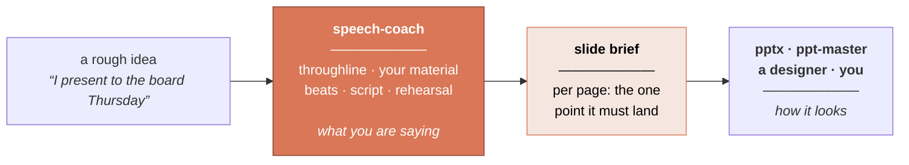

<div align="center">

# Speech Coach

### The step before the slides.

**Every deck tool makes your presentation look good. None of them can tell you what to say.**

A Claude Agent Skill that builds the storyline first. Tell it what you have to present —
it interviews you, then produces a structure, a script written to be spoken aloud, and a
slide brief you hand to any deck tool. Works for talks with no slides at all, too.

[](LICENSE)
[](https://code.claude.com/docs)
[](speech-coach/scripts/speech_check.py)

**English** · [简体中文](README.zh-CN.md)

</div>

---

## What comes out

**You say:**

> *"I have eight minutes with the board on Thursday. I need two more engineers."*

**It asks two questions, guesses the rest for you to correct, and lands your one sentence:**

> ### "We're paying twelve people to do what one tool could do."

Then it builds three things.

<br>

**1 · A structure** — beats, time budget, and a tension curve you can look at:

| # | Beat | Min | Stake | Material |
|---|---|---|---|---|
| 1 | Attention | 0.5 | 3 | The printed spreadsheet + the confession |
| 2 | Need | 2.0 | **5** | 31%, Marcus's Tuesday |
| 3 | Satisfaction | 1.5 | 3 | The tool, scoped |
| 4 | Visualization | 1.5 | 4 | Both futures |
| 5 | Action | 1.0 | 4 | Two engineers, six weeks |

*Stake is how much tension is live at that moment. A flat column is the single most common
structural defect, and it's why talks feel boring — no amount of better wording fixes it.*

<br>

**2 · A script for the ear** — your register, delivery marked, cuts pre-planned:

```
[Hold up the printed spreadsheet. Say nothing for two seconds.]

This is one file. Forty tabs. [PAUSE]

A support lead named Marcus maintains it by hand. Every week. He has done it for
two years.

I'm the reason it exists. Two years ago I approved it as a temporary workaround,
and I want to talk to you about what temporary cost us. [PAUSE]
```

<br>

**3 · A slide brief** — per page, the one point it has to land. Hand it to your deck tool:

| # | The point | Must be visible | Hold |
|---|---|---|---|
| 2 | Nearly a third of Ops capacity goes to reconciliation, not customers | One number: **31%**. No chart, no title, no logo | 40s |
| 3 | The manual work scales at the same rate as the business | Two lines on one axis, volume and reconciliation hours, rising together. Annotate where they cross | 60s |

It says nothing about fonts or colour, on purpose — that's the deck builder's craft.

**→ [Read the whole thing end to end](speech-coach/references/worked-example.md)** — brief,
material, beat sheet, full script, checker output, slide brief, rehearsal plan.

---

## Where it fits

There are dozens of skills and tools that turn a prompt into a polished deck, and they work.
**Making slides look good is solved.**

But nobody sat through a bad presentation and thought *the typography let this down.* They
thought: **I don't know what this person wanted from me.** That failure happens one step
earlier — before a single slide exists — and no amount of deck generation reaches back to
fix it. Every slide tool inherits a storyline it did not write and cannot check.

That missing step is this.



**Use it with whatever you already use to make slides.** Different halves of the same problem.

---

## Install

```bash
git clone https://github.com/WinterDDo/Speech-Coach-Skill.git
cp -r Speech-Coach-Skill/speech-coach ~/.claude/skills/
```

For one project only, copy it into that repo's `.claude/skills/` instead. Then just say what
you're facing:

> *"My sister's wedding is in three weeks and I'm the best man. I have nothing."*
>
> *"Here's my deck. It's 40 slides and it isn't landing. Why?"*
>
> *"I have to announce the layoffs on Monday."*
>
> *"How should I open a conference talk about database migrations?"*

Board updates, keynotes, conference talks, investor pitches, product launches, all-hands,
town halls, sales narratives, training, panels, toasts, wedding speeches, eulogies, award
acceptances — and *"help me with my slides."*

---

## Why not just ask for a speech

Ask any model to "write me a speech about X" and you get something fluent, structurally
generic, and full of details that never happened. Five things work against that:

- **It won't invent your life.** The best material in any talk is only yours — the night the
  line went down, the number that surprised you. It asks instead of inventing; gaps come back
  as `[YOUR STORY HERE — needs: …]`, never a plausible lie. A speaker who finds out on stage
  that their own anecdote is fiction has been harmed, not helped.
- **Structure is settled before prose.** No sentences until you've approved a throughline and
  a skeleton. Polishing words on a broken structure gives you a polished wrong speech.
- **It writes in your voice, not a good one.** The clearest tell of machine-written speech is
  that it doesn't sound like the speaker — and audiences read that as insincerity.
- **The occasion picks the structure.** Eleven archetypes, chosen by what the audience has to
  *do* in the room. A board update and a TED talk are not the same shape.
- **Revision is the job.** *"It's boring"* is almost never a word problem, so it diagnoses
  which layer is actually broken before touching a sentence — and keeps versions, because the
  line that made the talk worth giving is often the one sanded off in round three.

---

## What's inside

```
speech-coach/
├── SKILL.md                    the workflow, its gates, and the quality bar
├── references/
│   ├── principles.md           what the masters share — and where they disagree
│   ├── archetypes.md           11 occasion-specific skeletons with beat sheets
│   ├── material-mining.md      getting the real material out of the speaker
│   ├── voice.md                sounding like the speaker, not like a speech
│   ├── language.md             writing for the ear; also: writing to be interpreted
│   ├── openings-closings.md    7 openings and 6 closings that work — and what never does
│   ├── deck.md                 slides, data, and the slide-brief spec
│   ├── delivery.md             rehearsal, nerves, Q&A, virtual, recovery
│   ├── teardowns.md            5 canonical speeches, structurally dismantled
│   └── worked-example.md       the whole workflow run once, end to end
├── assets/                     fill-in templates, including the slide brief
└── scripts/
    └── speech_check.py         runtime, pacing, sentence length, clichés
```

`speech_check.py` is stdlib-only Python 3.8+. It measures runtime against the clock, flags
sentences too long to say in one breath (in *seconds*, so the test holds across languages),
and catches clichés and filler. A smoke detector, not a judge.

---

## Where the method comes from

Two thousand years separate Aristotle from Nancy Duarte. A Baptist preacher in Memphis and a
Cupertino product launch have nothing culturally in common. Strip the surface, and the same
small set of laws keeps reappearing — arrived at independently by people who never read each
other. That convergence is the evidence.

Aristotle and Cicero. Dale Carnegie on earning the right to speak. Monroe's Motivated
Sequence. Minto's Pyramid Principle. Duarte on narrative tension. Chris Anderson's TED
framework. The Heath brothers on concreteness, and Paul Slovic on why one named person beats
a statistic. Churchill's own 1897 essay on the mechanics of rhetoric.

Plus five speeches taken apart in [`teardowns.md`](speech-coach/references/teardowns.md) —
Lincoln, Churchill, King, Jobs, Obama — each with a section on **what not to copy**.

Where popular advice is shakier than its confidence suggests — the "7-38-55 rule," power
posing — this says so rather than repeating it.

---

## Questions

**Does it actually make the PowerPoint file?**
No — and that's deliberate. It produces the brief that says what each page must land, then
hands it to a tool that builds decks well (`pptx`, `ppt-master`, a designer). Welding
narrative to file production makes both harder to revise, and you'd be locked to one
renderer.

**What if my talk has no slides?**
Then it's still the right tool, and it may tell you that you don't need slides at all — a
legitimate output. Eulogies, toasts, apologies, all-hands and Q&A are all covered, and none
of them want a deck.

**Does it just write the speech for me?**
No. It interviews you, then writes. That's slower than a one-shot generator and it's the
entire reason the output is usable.

**Can I use it on a deck or draft I already have?**
Yes, and it's a common entry point. It reverse-engineers the argument from your slide
headlines and tells you whether a throughline survives. Expect the deck to shrink.

**Does it work with pptx / ppt-master / other slide skills?**
That's the design. The slide brief is written to be handed over whole and unedited.

**Does it work in languages other than English?**
The skill is English for now, but handles other languages fine — the checker already does CJK
pacing and segmentation, and `language.md` covers writing for interpretation. Native versions
elsewhere are on the roadmap, as adaptations rather than translations: the laws travel, the
conventions don't.

---

## Roadmap

- [ ] Native versions in more languages — adaptations, not translations.
- [ ] Teardowns from outside the Anglo-American canon.
- [ ] Worked examples for more archetypes. One exists; ceremonial and crisis are next.
- [ ] **Field reports.** Components are verified and the worked example reproduces exactly,
      but the workflow needs real speeches under real deadlines. If you use it, open an issue
      and say what broke.

Issues and pull requests welcome.

---

## License

[MIT](LICENSE) — use, modify and redistribute freely, including commercially. The one
condition is that the copyright notice travels with it. A permissive license is not a waiver
of copyright: the work stays the author's, and the license is a standing grant of permission.

*This repository is mostly written methodology rather than code, and MIT is drafted for
software. It's applied repo-wide for simplicity, common practice for documentation-heavy
projects. Attribution is required either way.*
