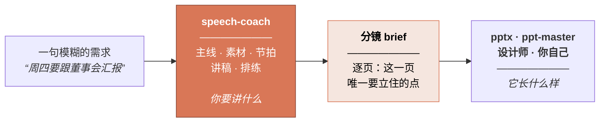

<div align="center">

# Speech Coach 演讲教练

### 做 PPT 的前一步。

**所有 PPT 工具都能把你的片子做好看。但没有一个能告诉你该讲什么。**

一个先把 storyline 立起来的 Claude Agent Skill。告诉它你要讲什么场合，它采访你，
然后产出一套结构、一份能上口的讲稿，以及一份可以直接交给任何 PPT 工具的分镜 brief。
**完全不用 PPT 的场合，它一样管。**

[](LICENSE)
[](https://code.claude.com/docs)
[](speech-coach/scripts/speech_check.py)

[English](README.md) · **简体中文**

</div>

---

## 它到底产出什么

**你说：**

> *"周四要跟董事会讲八分钟，我需要他们批两个工程师。"*

**它问你两个问题，其余全部猜好等你纠正，然后把你的那一句话定下来：**

> ### "我们在花十二个人的钱，做一个工具就能做的事。"

然后它造三样东西。

<br>

**1 · 一套结构** —— 节拍、时间预算，以及一条你能直接看的张力曲线：

| # | 节拍 | 分钟 | 张力 | 用到的素材 |
|---|---|---|---|---|
| 1 | 引起注意 | 0.5 | 3 | 打印出来的表格 + 自我坦白 |
| 2 | 建立需求 | 2.0 | **5** | 31%、老陈的星期二 |
| 3 | 给出方案 | 1.5 | 3 | 工具，界定好范围 |
| 4 | 描绘图景 | 1.5 | 4 | 两种未来 |
| 5 | 提出行动 | 1.0 | 4 | 两个工程师，六周 |

*张力 = 那一刻有多少悬念是活的。**这一列如果是平的，就是最常见的结构病**，
也是演讲让人犯困的真正原因——换多好的措辞都救不回来。*

<br>

**2 · 一份为耳朵写的讲稿** —— 你的语感、标好停顿、预设好超时删减位：

```
[举起打印出来的表格。什么都不说，停两秒。]

这是一个文件。四十个标签页。[停顿]

一位叫老陈的客服主管在手工维护它。每周一次。他已经做了两年。

它之所以存在，是因为我。两年前是我批准的，当时说是临时方案——
我今天想跟各位说的，就是这个"临时"到底花了我们多少钱。[停顿]
```

<br>

**3 · 一份分镜 brief** —— 逐页写明这一页唯一要立住的点，直接交给你的 PPT 工具：

| # | 这一页要立住的点 | 屏幕上必须有 | 停留 |
|---|---|---|---|
| 2 | 客服近三分之一的产能花在对数据上，不是花在客户身上 | 一个数字：**31%**。不要图表、不要标题、不要 logo | 40 秒 |
| 3 | 人工投入随业务同速增长 | 同一坐标轴两条线，业务量与对账工时同时上升，标注出本季度交叉的位置 | 60 秒 |

它**刻意不谈**字体和配色——那是做 PPT 的人的手艺。

**→ [看完整的一遍走通](speech-coach/references/worked-example.md)** ——
从 brief、素材、节拍表、完整讲稿、体检输出，到分镜和排练方案。

---

## 它在整条链路的什么位置

现在能把一句提示词变成一套精美幻灯片的 skill 和工具已经有几十个，而且都挺好用。
**"把片子做好看"这件事已经被解决了。**

但没有人听完一场糟糕的汇报，心里想的是*"这个字体没选好"*。
他们想的是：**我不知道这个人到底要我干嘛。**
这个失败发生在更早一步——在第一页幻灯片存在之前——而再强的生成工具也回头补不了。
**每一个 PPT 工具，都在继承一条它自己没写、也检查不了的 storyline。**

缺的那一步，就是这个。



**它跟你现在用的任何 PPT 工具都是配合关系**——两边解决的是同一个问题的两半。

---

## 安装

```bash
git clone https://github.com/WinterDDo/Speech-Coach-Skill.git
cp -r Speech-Coach-Skill/speech-coach ~/.claude/skills/
```

只想在某个项目里用，就拷进该项目的 `.claude/skills/`。然后直接说你面对的状况：

> *"三周后我姐结婚，我是伴郎，现在一个字都没有。"*
>
> *"这是我的 PPT，40 页，讲不动。问题出在哪？"*
>
> *"周一我要宣布裁员。"*
>
> *"一场讲数据库迁移的技术分享，开场该怎么开？"*

董事会汇报、主题演讲、技术大会分享、融资路演、产品发布会、全员会、述职、
销售讲解、培训、圆桌、祝酒词、婚礼致辞、悼词、领奖感言——
以及**"帮我看看我的 PPT"**。

---

## 跟直接让 AI"写篇演讲稿"差在哪

随便让哪个模型"写一篇关于 X 的演讲稿"，你会得到一段流畅、结构套路化、
并且塞满了从未发生过的细节的文字。这里有五件事是专门跟这个对着干的：

- **它不编造你的人生。** 一场演讲里最值钱的素材只有你有——产线停掉的那晚、
  那个让你自己都意外的数字。它选择问，而不是编；缺的地方返回
  `[YOUR STORY HERE — needs: …]`，绝不是一段听起来很真的假话。
  **一个人站在台上才发现自己的"亲身经历"是虚构的，那是被害了，不是被帮了。**
- **结构没定死，绝不动笔。** 主线和骨架没经你确认就不写句子。
  在错的结构上打磨文字，只会得到一篇精致的错稿。
- **它用你的语感写，不是用"好的语感"写。** AI 稿子最明显的破绽就是不像本人说的话，
  而听众会把这个**读成不真诚**。
- **场合决定结构。** 十一套骨架，按"听众在这个房间里到底要干什么"来选。
  董事会汇报和 TED 演讲不是一个形状。
- **改稿被当成正事。** **"太闷了"几乎从来不是文字问题**，所以它先诊断到底哪一层坏了，
  再动句子；并且保留版本，因为那句让稿子值得讲的话，往往正是第三轮被磨掉的那句。

---

## 里面有什么

```
speech-coach/
├── SKILL.md                    工作流、闸门、质量红线
├── references/
│   ├── principles.md           顶级演讲家的共通法则——以及他们分歧在哪
│   ├── archetypes.md           11 套场景骨架，每套带节拍表
│   ├── material-mining.md      怎么从演讲者嘴里把真素材挖出来
│   ├── voice.md                让稿子像本人说的话，而不是像一篇演讲
│   ├── language.md             为耳朵而写；另含：为交传/同传而写
│   ├── openings-closings.md    7 种有效开场、6 种有效收尾，以及绝不能用的那些
│   ├── deck.md                 幻灯片、数据图、分镜 brief 规范
│   ├── delivery.md             排练、紧张、Q&A、线上、翻车自救
│   ├── teardowns.md            5 篇经典演讲的结构拆解
│   └── worked-example.md       完整流程从头到尾跑一遍
├── assets/                     各阶段交付模板，含分镜 brief
└── scripts/
    └── speech_check.py         时长、配速、句长、陈词滥调
```

`speech_check.py` 纯标准库，Python 3.8+。它按时钟算时长、
揪出一口气说不完的句子（**按秒算，所以跨语种都成立**）、抓陈词滥调和口水词。
是烟雾报警器，不是裁判。

---

## 方法从哪来

亚里士多德到 Nancy Duarte 之间隔了两千年。孟菲斯的一位浸信会牧师，
和库比蒂诺的一场产品发布会，在文化上毫无共同之处。但把表层剥掉，
**同一小组法则会反复出现**——由一群互相没读过对方的人各自独立得出。
这种收敛本身就是证据。

亚里士多德与西塞罗。卡耐基论"取得谈论这个话题的资格"。Monroe 动机序列。
明托金字塔原理。Duarte 论叙事张力。Chris Anderson 的 TED 框架。
希思兄弟论具体性，以及 Paul Slovic 关于"为什么一个有名有姓的人胜过一个统计数字"的研究。
还有丘吉尔本人 1897 年那篇论修辞机理的文章。

外加 [`teardowns.md`](speech-coach/references/teardowns.md) 里五篇拆到骨头的演讲——
林肯、丘吉尔、马丁·路德·金、乔布斯、奥巴马——**每一篇都写了"哪些不能学"**。

凡是流行说法比它的自信程度更站不住脚的——"7-38-55 法则"、power posing——
这里会直说，而不是跟着复述。

---

## 常见问题

**它会直接给我生成 PPT 文件吗？**
不会，而且这是刻意的。它产出的是「每一页要立住什么」的 brief，
然后交给真正擅长做片子的工具（`pptx`、`ppt-master`、设计师）。
把叙事和排版焊在一起，两边都变得难改，而且会被锁死在某一个渲染器上。

**我的场合根本没有 PPT，还能用吗？**
能，而且它可能会直接告诉你**不需要做 PPT**——这是一个合法的结论。
悼词、祝酒、道歉、全员会、答问，都在覆盖范围内，而这些场合都不需要片子。

**它是不是直接把稿子写给我？**
不是。它先采访你，再写。这比一键生成慢，而这正是产出能用的全部原因。

**我已经有 PPT / 有草稿了，能用吗？**
能，而且这是很常见的入口。它会从你的页面标题反推论证结构，告诉你主线还在不在。
**做好 PPT 会变短的准备。**

**能跟 pptx / ppt-master 这类做 PPT 的 skill 配合吗？**
本来就是这么设计的。分镜 brief 就是为了整份、不加编辑地交出去。

**支持中文吗？**
skill 本体目前是英文的，但处理中文内容没问题——体检脚本已支持中文语速和断句，
`language.md` 里也写了怎么为交传和同传写稿。其他语种的原生版本在路线图上，
是**改写**而非翻译：法则可迁移，惯例不可以。

---

## 路线图

- [ ] 其他语种的原生版本——改写，不是翻译。
- [ ] 英美经典之外的演讲拆解。
- [ ] 更多场景的完整案例。目前有一个，礼仪类和危机沟通是接下来最该补的。
- [ ] **实战反馈。** 组件都验证过、案例完全可复现，
      但这套流程还需要真实的演讲、真实的截止日期来检验。用了之后欢迎开 issue 说哪里崩了。

欢迎提 issue 和 PR。

---

## 许可

[MIT](LICENSE) —— 可自由使用、修改、再分发，包括商用。**唯一条件是版权声明必须跟着走。**
选择宽松许可不等于放弃著作权：作品的著作权始终属于作者，许可只是一份长期有效的授权。

*这个仓库主要是文字方法论而非代码，而 MIT 是为软件起草的。
这里为了简单起见全仓库统一适用，也是文档为主的项目的通行做法。无论如何，署名都是必须的。*
