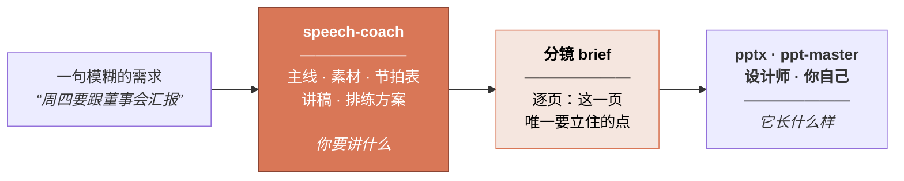

<div align="center">

# Speech Coach 演讲教练

**在做 PPT 之前，先把你到底要讲什么想清楚。**

一个 Claude Agent Skill：把一句模糊的需求，变成演讲框架、能上口的讲稿，
以及一份可以直接交给任何 PPT 工具的分镜 brief。

[](LICENSE)
[](https://code.claude.com/docs)
[](speech-coach/scripts/speech_check.py)

[English](README.md) · **简体中文**

</div>

---

> ### AI 三十秒就能给你做出一套 PPT。但它还是说不出你到底要讲什么。

现在能把一句提示词变成成套幻灯片的工具已经有几十个了，而且都挺好用。**幻灯片早就不是难的那一环。**

可是没有人听完一场糟糕的汇报，心里想的是"这个字体没选好"。他们想的是：**我不知道这个人到底要我干嘛。**
这个失败发生在更早一步——在第一页幻灯片存在之前——而再强的生成工具也回头补不了这一步。

这个 skill 就是那更早的一步。它先帮你把要讲的事、要打动的人、每一页要证明什么想清楚，
然后才把一份值得做的 brief 交给你的 PPT 工具。

---

## 它不取代你的 PPT 工具，它给 PPT 工具喂料



分镜 brief 会写："第 3 页要证明人工投入随营收同步增长——同一坐标轴两条线，标注出本季度交叉的位置。"
它**刻意不谈**字体和配色。那是做 PPT 的人的手艺，交给他们更好。

**所以它跟你现在用的任何 PPT 工具都是配合关系**，两边解决的是同一个问题的两半。

---

## 你会拿到什么

| | |
|---|---|
| **一套框架** | 你的那一句话主线、匹配场合的结构骨架、带时间预算和张力曲线的节拍表 |
| **一份讲稿** | 为**耳朵**而写，用**你自己**的语感，标好停顿点和超时时的预设删减位 |
| **一份分镜 brief** | 逐页写明：这页唯一要立住的点、屏幕上必须出现什么、你在上面说什么——可直接交给任何 PPT 工具 |
| **一份排练方案** | 背哪几句、在哪停顿、最难的五个提问、设备挂了怎么办 |

外加一个零依赖的体检脚本：按时钟算时长、揪出一口气说不完的长句、抓陈词滥调。

---

## 安装

```bash
git clone https://github.com/WinterDDo/Speech-Coach-Skill.git
cp -r Speech-Coach-Skill/speech-coach ~/.claude/skills/
```

只想在某个项目里用，就拷进该项目的 `.claude/skills/`。

然后直接说你面对的状况：

> *"周四要跟董事会讲十分钟，我需要他们批两个工程师。"*

> *"三周后我姐结婚，我是伴郎，现在一个字都没有。"*

> *"这是我的 PPT，40 页，讲不动。问题出在哪？"*

> *"周一我要宣布裁员。"*

> *"一场讲数据库迁移的技术大会演讲，开场该怎么开？"*

它会在这些场景下触发：演讲、talk、主题演讲、技术大会分享、提案、路演、融资演示、产品发布会、
全员会、市政厅会议、董事会汇报、述职、销售讲解、培训、圆桌、祝酒词、婚礼致辞、悼词、领奖感言——
以及**"帮我看看我的 PPT"**。

---

## 跟直接让 AI"写篇演讲稿"差在哪

随便让哪个模型"写一篇关于 X 的演讲稿"，你会得到一段流畅、结构套路化、
并且塞满了从未发生过的细节的文字。这里有五件事是专门跟这个对着干的：

**它拒绝编造你的人生。** 一场演讲里最值钱的，是只有你有的素材——产线停掉的那个晚上、
那个让你自己都意外的数字、客户原话是怎么说的。模型能给结构、节奏和手艺，
**给不了这些**，所以它选择问，而不是编。缺的地方会写成
`[YOUR STORY HERE — needs: …]`，绝不会是一段听起来很真的假话。
一个演讲者站在台上才发现自己的"亲身经历"是虚构的，那是被害了，不是被帮了。

**结构没定死，绝不动笔。** 主线和骨架没经你确认，它不写句子。
在错的结构上打磨文字，只会得到一篇精致的错稿。

**它用你的语感写，不是用"好的语感"写。** AI 写的稿子最明显的破绽，
就是不像本人说的话——而听众会把这个**读成不真诚**。所以它先建一份"声音画像"，
写完再拿回来对。**一句你能坦然说出口的大白话，胜过一句明显穿在身上的漂亮话。**

**场合决定结构。** 十一套骨架，按"听众在这个房间里到底要干什么"来选。
董事会汇报和 TED 演讲不是一个形状，拿错了是很常见、也很贵的错误。

**改稿被当成正事。** 绝大多数对演讲的不满，都是结构病的表面症状——
**"太闷了"几乎从来不是文字问题**。所以它会先诊断到底哪一层坏了，再动句子；
并且保留版本，因为那句让这篇稿子值得讲的话，
往往正是第三轮打磨时被磨掉的那句。

---

## 里面有什么

```
speech-coach/
├── SKILL.md                    工作流、闸门、质量红线
├── references/
│   ├── principles.md           顶级演讲家的共通法则——以及他们分歧在哪
│   ├── archetypes.md           11 套场景骨架，每套带节拍表
│   ├── material-mining.md      怎么从演讲者嘴里把真素材挖出来
│   ├── voice.md                让稿子像本人说的话，而不是像一篇演讲
│   ├── language.md             为耳朵而写；另含：为交传/同传而写
│   ├── openings-closings.md    7 种有效开场、6 种有效收尾，以及绝不能用的那些
│   ├── deck.md                 幻灯片、数据图、分镜 brief 规范
│   ├── delivery.md             排练、紧张、Q&A、线上、翻车自救
│   ├── teardowns.md            5 篇经典演讲的结构拆解
│   └── worked-example.md       完整流程从头到尾跑一遍
├── assets/                     各阶段交付模板，含分镜 brief
└── scripts/
    └── speech_check.py         时长、配速、句长、陈词滥调
```

体检脚本纯标准库，Python 3.8+：

```bash
python3 speech_check.py draft.md --wpm 140 --target-minutes 10
```

它测：时长对预算、分段配速、**一口气说不完的句子（按秒算，所以跨语种都成立）**、
陈词滥调与口水词密度、被动语态、数字密度。它是烟雾报警器，不是裁判。

---

## 方法从哪来

亚里士多德到 Nancy Duarte 之间隔了两千年。孟菲斯的一位浸信会牧师，
和库比蒂诺的一场产品发布会，在文化上毫无共同之处。
但把表层剥掉，**同一小组法则会反复出现**——由一群互相没读过对方的人各自独立得出。
这种收敛本身就是证据。

亚里士多德《修辞学》与西塞罗的五艺。卡耐基论"取得谈论这个话题的资格"。
Monroe 动机序列。芭芭拉·明托的金字塔原理。Duarte 论叙事张力。
Chris Anderson 的 TED 框架。奇普·希思兄弟论具体性，
以及 Paul Slovic 关于"为什么一个有名有姓的人胜过一个统计数字"的研究。
还有丘吉尔本人 1897 年那篇论修辞机理的文章。

外加 [`teardowns.md`](speech-coach/references/teardowns.md) 里五篇拆到骨头的演讲——
林肯、丘吉尔、马丁·路德·金、乔布斯、奥巴马——**每一篇都写了"哪些不能学"**，
这部分和其余同样重要。

凡是流行说法比它的自信程度更站不住脚的——比如"7-38-55 法则"、power posing——
这里会直说，而不是跟着复述。

---

## 常见问题

**它是不是直接把稿子写给我？**
不是。它先采访你，再写。只有你能提供的部分，它会问。
这确实比一键生成慢，而这正是产出能用的全部原因。

**我已经有 PPT / 有草稿了，能用吗？**
能，而且这是很常见的入口。它会从你的页面标题反推论证结构，
告诉你主线还在不在，然后从那里重建。**做好 PPT 会变短的准备。**

**它跟 pptx / ppt-master 这类做 PPT 的 skill 能配合吗？**
本来就是这么设计的。它产出的分镜 brief 就是为了**整份、不加编辑**地交出去，
文件里自带一段写给"做 PPT 的人"的说明。

**它会编造关于我的故事吗？**
不会，这是第一条铁律。缺口会以带标注的占位符返回。

**支持中文吗？**
skill 本体目前是英文的，但**处理中文内容没问题**——体检脚本已经支持中文语速和断句，
`language.md` 里也写了怎么为交替传译和同声传译写稿。
其他语种的原生版本在路线图上——是**改写**，不是翻译，因为法则可迁移、惯例不可以。

**只能用于商务汇报吗？**
不是。十一套骨架里包含礼仪类场合——祝酒、婚礼、悼词、领奖——
它们有自己的结构和自己的陷阱。（堆形容词。**一个真实的细节胜过十个形容词。**）

---

## 路线图

- [ ] 其他语种的原生版本——是改写而非翻译。法则可迁移，惯例不可以。
      `principles.md` 里已经标出了英美语境不通用的地方：
      诉求要不要直说、自嘲、结论前置、个人袒露的尺度。
- [ ] 英美经典之外的演讲拆解。
- [ ] 更多场景的完整案例。目前有一个（说服型内部提案），
      礼仪类和危机沟通是最该补的两个。
- [ ] **实战反馈。** 组件都验证过、案例完全可复现，
      但这套流程还需要真实的演讲、真实的截止日期来检验。
      你用了之后欢迎开 issue 说说哪里崩了。

欢迎提 issue 和 PR。

---

## 许可

[MIT](LICENSE) —— 任何人都可以自由使用、修改、再分发，包括商用，不必征求许可。
**唯一的条件是版权声明必须跟着走。**

选择宽松许可不等于放弃著作权：作品的著作权始终属于作者，许可只是一份长期有效的授权。

*给要复用文字部分的人一句提醒：这个仓库主要是文字方法论而非代码，
而 MIT 是为软件起草的。这里为了简单起见全仓库统一适用，
这也是文档为主的项目的通行做法。无论如何，署名都是必须的。*
